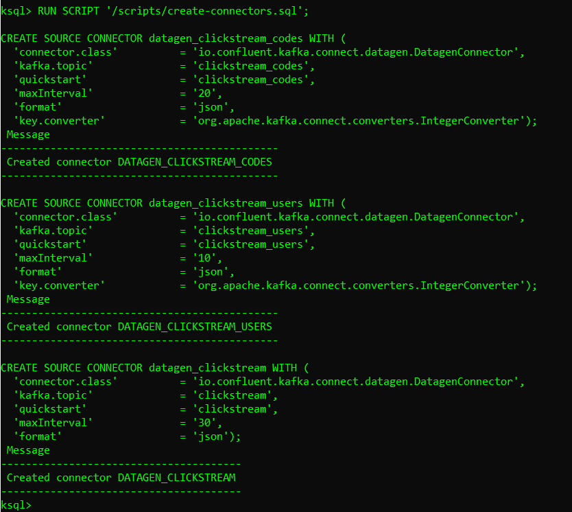

# Installation
```bash
https://github.com/Vlad-Misiukevich/m10_kafkabasics_sql_local.git
```
# Requirements
* Python 3.8
* Windows OS
* WSL2
* Docker version 1.11 or later
* Docker compose
# Description
1. Run WSL2
2. Change directory to m10_kafkabasics_sql_local:
```bash
cd m10_kafkabasics_sql_local/
```
3. Run command:
```bash
sudo sysctl -w vm.max_map_count=262144
```

4. Get the Jar files for kafka-connect-datagen and kafka-connect-elasticsearch:
```bash
docker run -v $PWD/confluent-hub-components:/share/confluent-hub-components confluentinc/ksqldb-server:0.8.0 confluent-hub install --no-prompt confluentinc/kafka-connect-datagen:0.4.0
```

```bash
docker run -v $PWD/confluent-hub-components:/share/confluent-hub-components confluentinc/ksqldb-server:0.8.0 confluent-hub install --no-prompt confluentinc/kafka-connect-elasticsearch:10.0.2
```

5. Run the tutorial in Docker:
```bash
docker-compose up -d
```

6. Run the status command to ensure that everything has started correctly:
```bash
docker-compose ps
```

7. Run the ksqlDB CLI:
```bash
docker-compose exec ksqldb-cli ksql http://ksqldb-server:8088
```

8. Ensure the ksqlDB server is ready to receive requests:
```bash
show topics;
```

9. Run the script:
```bash
RUN SCRIPT '/scripts/create-connectors.sql';
```

10. Sample the messages in the clickstream topic:
```bash
print clickstream limit 3;
```

11. Sample the messages in the clickstream_codes topic:
```bash
print clickstream_codes limit 3;
```

12. Sample the messages in the clickstream_users topic:
```bash
print clickstream_users limit 3;
```

13. Go to UI at http://localhost:9021 and view the three kafka-connect-datagen source connectors:

14. Load the file that runs the tutorial app.
```bash
RUN SCRIPT '/scripts/statements.sql';
```

15. Exit out of the ksqldb-cli with a CTRL+D command:

16. Go to UI and view the ksqlDB view Flow:

17. Verify that data is being streamed through various tables and streams. Query one of the streams CLICKSTREAM:

18. Set up the required Elasticsearch document mapping template:
```bash
docker-compose exec elasticsearch bash -c '/scripts/elastic-dynamic-template.sh'
```

19. Run this command to send the ksqlDB tables to Elasticsearch and Grafana:
```bash
docker-compose exec ksqldb-server bash -c '/scripts/ksql-tables-to-grafana.sh'
```

20. Load the dashboard into Grafana:
```bash
docker-compose exec grafana bash -c '/scripts/clickstream-analysis-dashboard.sh'
```

21. Grafana dashboard:

22. In the UI at http://localhost:9021 view the running connectors:

23. Generate the session data:
```bash
./sessionize-data.sh
```

24. Clickstream Analysis Dashboard:

### Metrics
1. General website analytics, such as hit count and visitors:

2. Mapping user-IP addresses to actual users and their location:

3. Error-code occurrence and enrichment:
